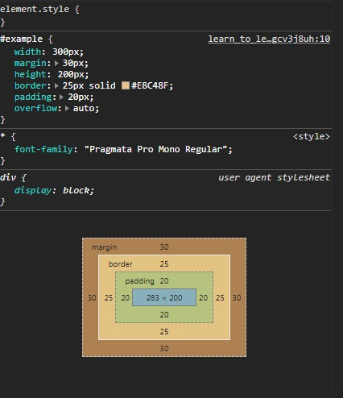
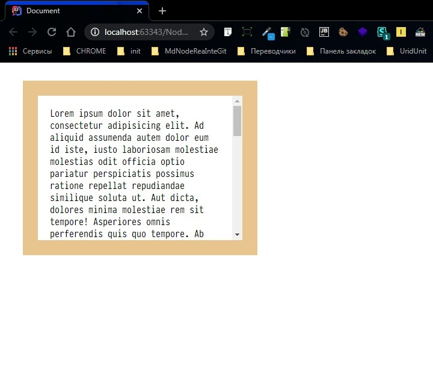

# [Размеры и прокрутка элементов](https://learn.javascript.ru/size-and-scroll)

<a href="E:\Node_projects\Node_Way\Education\Education_Store\S_6\Readme.md">S_6\Readme.md</a>

## Простой пример

    <head>

    

    </head>
    <body>
    

        Lorem ipsum dolor sit amet, consectetur adipisicing ...
    

    </body>

